# **Documentación Técnica del Sistema Nexus (Spectra)**

## **Introducción**

El presente documento técnico describe la arquitectura, diseño y despliegue del ecosistema **Nexus (Spectra)**, compuesto por tres sistemas principales:

* **Agencia de Viajes**
* **Hotelería**
* **Aerolínea**

La agencia actúa como **agregador** que consulta en tiempo real la disponibilidad y tarifas de los otros dos sistemas, integrándolos en una experiencia unificada para el usuario.
El proyecto se construye bajo una arquitectura de **microservicios**, desplegada en **Google Kubernetes Engine (GKE Autopilot)** y respaldada por un proceso de **integración y entrega continua (CI/CD)** automatizado mediante **Drone**, **SonarQube** y **Artifact Registry**.

El documento cubre:

* Diagramas de alto nivel y flujos de datos.
* Detalle del pipeline CI/CD con validación de calidad.
* Análisis ADD (Architecture Driven Design) de la aplicación y del pipeline.
* Justificación de las decisiones arquitectónicas tomadas.
* Comparación de infraestructura y costos entre GCP, AWS y Azure.

El objetivo es ofrecer una **visión integral** tanto de la arquitectura del sistema como de su **sostenibilidad técnica y económica**, garantizando calidad, disponibilidad y trazabilidad del software en entornos de desarrollo, prueba y producción.

---

# A. Diagrama general del sistema — Nexus (Spectra)

Este diagrama resume cómo se relacionan los actores externos (usuarios, GitHub), la **infraestructura en GCP** (GKE Autopilot, Artifact Registry, VM de SonarQube) y los **componentes de la app** (frontend, backend, Oracle) a través de namespaces (`dev`, `uat`, `main`, `ci`, `db`).

---

## 1) Vista general (alto nivel)

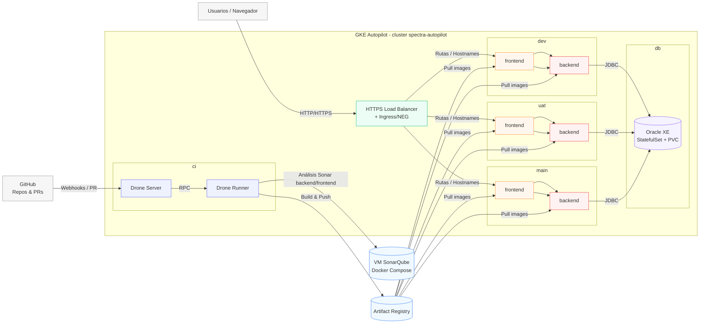

**Leyenda rápida**

* **GCLB/Ingress**: entrada única desde Internet; enruta por host/path a cada *frontend* (según `dev/uat/main`).
* **Frontend** (*SvelteKit*) llama a **Backend** (*Spring Boot*) vía `/nexus/*`.
* **Backend** usa **Oracle** (namespace `db`) vía JDBC; un solo clúster DB compartido.
* **Drone** (namespace `ci`) orquesta *pipelines*; invoca análisis SonarQube en la **VM**.
* **Artifact Registry** aloja imágenes de `frontend`/`backend`; los Deployments hacen *pull*.

---

## 2) Vista de despliegue por namespace (patrón repetible)

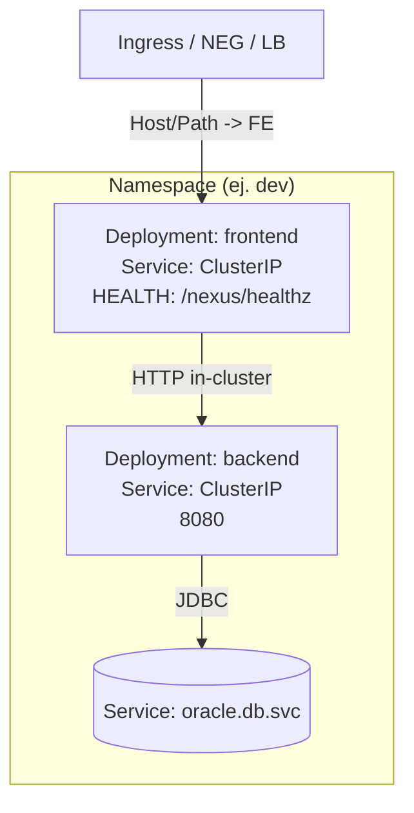

**Notas**

* Ingress publica dominios/paths por entorno; cada `frontend` expone el *site*.
* `PUBLIC_BACKEND_URL=/nexus` fija el *base path* para llamadas al backend.

---

## 3) Vista de flujo CI/CD (resumen)

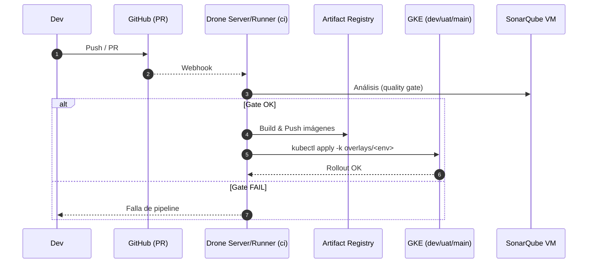

**Variantes de build**

* **Kaniko (in-cluster)** o **Cloud Build (GCB)** pueden generar y *pushear* imágenes al **Artifact Registry**.
* Las *overlays* de Kustomize fijan las imágenes por entorno para despliegues reproducibles.

---

## 4) Componentes clave

* **GKE Autopilot**: clúster administrado (control plane y nodos bajo demanda).
* **Namespaces**: `dev`, `uat`, `main` (runtime), `db` (Oracle), `ci` (Drone).
* **Ingress / GCLB**: entrada HTTP(S) con NEG por Service.
* **Frontend**: Svelte/Vite, despliegue por entorno, variables `PUBLIC_BACKEND_URL`.
* **Backend**: Spring Boot, expone `/nexus/*`, health `/nexus/healthz`.
* **Oracle XE**: StatefulSet + PVC (persistencia), Service estable para JDBC.
* **Artifact Registry**: almacenamiento de imágenes versionadas (tags por entorno o timestamp).
* **Drone**: orquestación CI/CD en `ci`; ejecuta análisis Sonar y despliegue.
* **SonarQube VM**: análisis estático, métricas, *quality gates*.

---

## 5) Suposiciones y límites de esta vista

* **Un solo** Oracle compartido por `dev/uat/main`. Si se aísla por entorno, se replicaría el patrón en más namespaces.
* Seguridad, observabilidad (GCM/Prometheus), *secrets* y *ingress domains* se detallarán en secciones B–D.
* El diagrama muestra **paths típicos**; reglas de *network policy*, *HPA*, *autoscaling* y *backup* se documentarán en D.

# B. Definición, explicación y diagramas del **pipeline**

Esta sección documenta el **ciclo de entrega** de Nexus (Spectra): desde el *push/PR* hasta el despliegue en **GKE Autopilot**, pasando por **quality gates** en SonarQube y publicación de imágenes en **Artifact Registry**. Se cubren variantes de build (**Kaniko** in‑cluster y **Cloud Build**), la estrategia por ramas (**dev / uat / main**), promoción, rollback y pre/post‑checks.

---

## 1) Resumen del flujo (alto nivel)

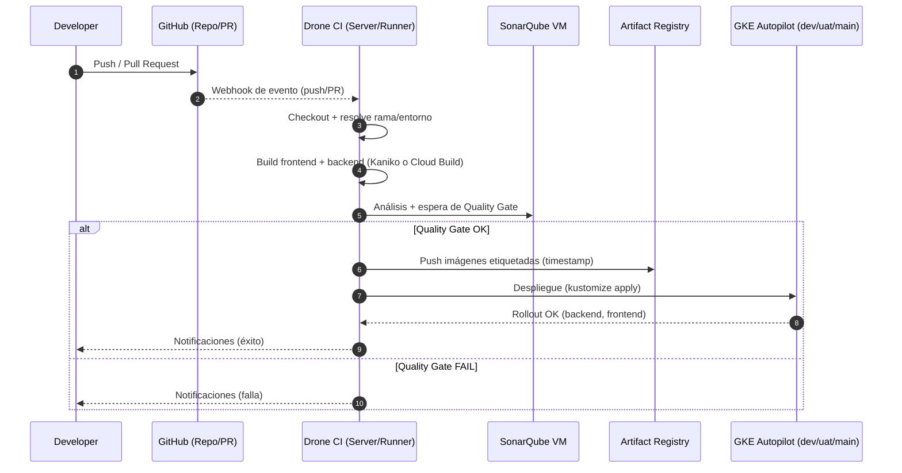

---

## 2) Triggers y estrategia por ramas

| Rama   | Entorno destino     | Tipo de ejecución         | Despliegue              |
| ------ | ------------------- | ------------------------- | ----------------------- |
| `dev`  | Namespace **dev**   | PRs/Merges a `dev`        | Automático tras Gate OK |
| `uat`  | Namespace **uat**   | Merge desde `dev`         | Automático tras Gate OK |
| `main` | Namespace **main`** | Release/Merge desde `uat` | Automático tras Gate OK |

**Notas**

* El pipeline corre en **cada push/PR**; el **despliegue** se ejecuta solo en ramas protegidas o cuando la política lo permita (ej. sólo tras merge).
* Las **overlays Kustomize** fijan la imagen por entorno; evitamos drift usando `kustomize edit set image` o *retag* del alias (`:dev`, `:uat`, `:main`).

---

## 3) Etapas del pipeline (detalle)

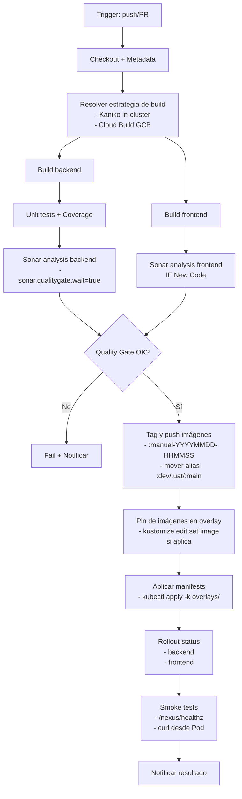

### 3.1 Checkout & Metadata

* Obtiene **SHA**, **rama**, y determina **entorno** (`dev`, `uat`, `main`).
* Calcula **STAMP** (`YYYYMMDD-HHmmss`) para etiquetar imágenes inmutables.

### 3.2 Build de imágenes

* **Kaniko (in-cluster)**: runner de Drone ejecuta contenedor Kaniko y *pushea* a Artifact Registry sin daemon Docker.
* **Cloud Build (GCB)**: dispara `gcloud builds submit` (por carpeta o config YAML) para construir y publicar.

### 3.3 Tests + SonarQube

* Backend: `./gradlew test jacocoTestReport sonar -Dsonar.qualitygate.wait=true`.
* Frontend: análisis opcional / enfoque **New Code** (evita frenar por deuda histórica; ver sección de políticas).

### 3.4 Versionado y publicación

* Empujar `nexus-backend:nombre:manual-$STAMP` y `nexus-frontend:manual-$STAMP`.
* **Promoción por alias**: mover `:dev` / `:uat` / `:main` al tag recién publicado (evita re‑render de Kustomize).

### 3.5 Despliegue (CD)

* Opción A: `kubectl apply -k k8s/overlays/<env>` (manifestos fuente‑de‑verdad).
* Opción B: solo `kubectl set image ...` **+** actualizar overlay con `kustomize edit set image` para que futuros apply no reviertan.

### 3.6 Verificación

* `kubectl -n <env> rollout status deploy/backend|frontend`.
* Smoke check: `curl http(s)://<LB>/nexus/healthz` y `curl in-cluster` al Service.

### 3.7 Notificaciones

* Éxito/falla a email (Gmail), GitHub PR checks y/o chat.

---

## 4) Artefactos, registros y configuración

* **Artifact Registry**: repos `nexus-backend`, `nexus-frontend`.
* **Etiquetas**: inmutables por timestamp; alias mutables por entorno (`:dev`, `:uat`, `:main`).
* **Manifests**: `k8s/base` + `k8s/overlays/{dev,uat,main}` (env, replicas, vars, probes, etc.).
* **Variables**: `PUBLIC_BACKEND_URL=/nexus` en frontend; JDBC/credenciales en backend vía `ConfigMap`/`Secret`.

---

## 5) Políticas de calidad y *gates*

* **Gate estricto en backend**: el job falla si el **Quality Gate** falla (mantenibilidad, cobertura mínima, vulnerabilidades).
* **Deuda histórica en frontend**: usar **"New Code"** en Sonar (comparación con base de PR/último *clean baseline*) para **solo fallar si empeora** (issues/coverage nuevos). Esto permite mejora gradual.
* **Pull Request decoration**: comentarios de Sonar en PR con issues, hotspots y cobertura.

> *Implementación práctica:* en Sonar definir "New Code" como *desde la rama base* o *desde una fecha*. Ajustar Quality Gate (condiciones en **New Code**) y opcionalmente relajar condiciones en Overall Code para frontend.

---

## 6) Promoción y release management

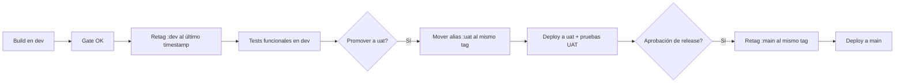

* **Sin rebuild** en promociones: sólo mover alias del **mismo tag** probado.
* Auditoría de promociones: registrar tag inmutable + commit SHA en los releases.

---

## 7) Rollback (rápido y reproducible)

1. **Alias back**: mover `:dev/:uat/:main` al **último tag conocido bueno**.
2. (Si se usó apply de Kustomize) **Actualizar overlay** con `kustomize edit set image` al tag bueno para que no se revierta.
3. `kubectl rollout undo deploy/backend|frontend` puede funcionar si el ReplicaSet previo está disponible, pero **preferir** rollback por imagen/tag para consistencia cross‑entornos.

---

## 8) Seguridad, secretos y cumplimiento

* **Secretos**: `DB_USER`, `DB_PASS`, `JWT_SECRET`, `DRONE_RPC_SECRET`, `SONAR_TOKEN`, `GMAIL_*` en **K8s Secrets** y/o Secrets del sistema CI.
* **Principio de menor privilegio**: cuentas de servicio con permisos limitados a `Artifact Registry` *push* y `kubectl` scoping por `Role/RoleBinding` al namespace.
* **Firma de imágenes / políticas** (opcional): Cosign + *admission policies* (Binary Authorization o Gatekeeper) para exigir firmas.

---

## 9) Observabilidad y pruebas post‑deploy

* **Health**: probes (`/nexus/healthz`).
* **Logs**: `kubectl logs`, Cloud Logging (si habilitado por GKE Autopilot).
* **Métricas**: GCM / Managed Prometheus (se documenta en la sección D).
* **Smoke suite**: pod `curl` temporal + pruebas leves del API y página principal del frontend.

---

## 10) Matriz de responsabilidades (RACI)

| Actividad               | R            | A         | C                      | I      |
| ----------------------- | ------------ | --------- | ---------------------- | ------ |
| Pipeline YAML/Dronefile | DevOps       | Tech Lead | Backend/Frontend Leads | Equipo |
| Reglas de ramas         | Tech Lead    | PO        | DevOps                 | Equipo |
| Quality Gate Sonar      | Backend Lead | Tech Lead | DevOps                 | Equipo |
| Infra y permisos CI     | DevOps       | Tech Lead | Seguridad              | Equipo |
| Promoción UAT→Main      | Tech Lead    | PO        | DevOps                 | Equipo |

---

## 11) Diagramas complementarios

### 11.1 Topología del pipeline (componentes CI/CD)

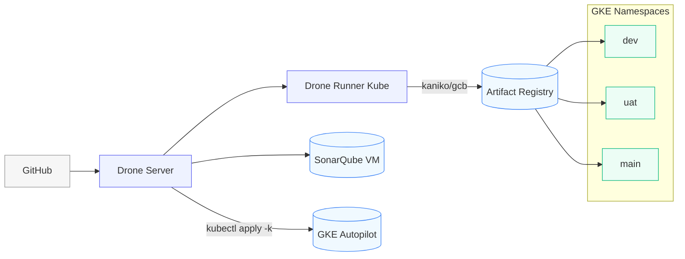

### 11.2 Decisor de Gate y despliegue

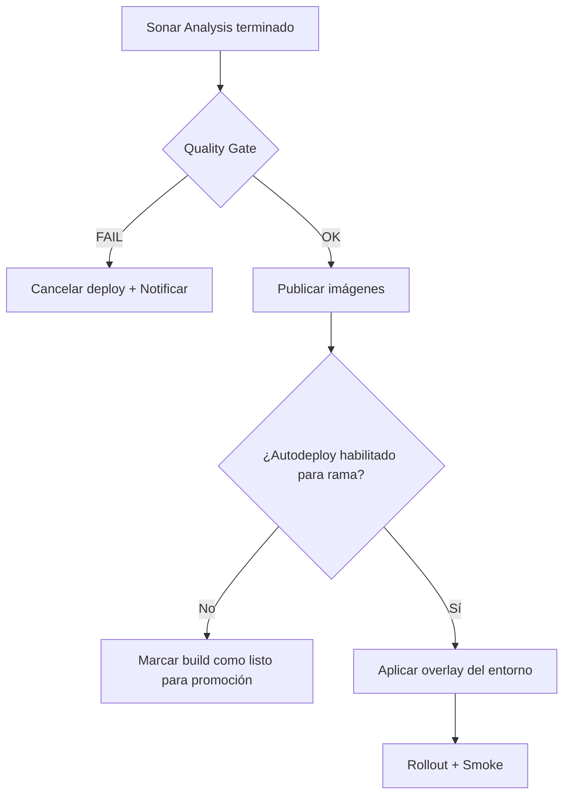

---

## 12) Checklist operativo (resumen práctico)

* [ ] Sonar `SONAR_HOST_URL` y `SONAR_TOKEN` configurados.
* [ ] Alias por entorno (`:dev/:uat/:main`) apuntan al tag correcto.
* [ ] Overlays en `k8s/overlays/*` alineados con imágenes **actuales** (`kustomize edit set image`).
* [ ] Secrets K8s presentes (`DB_*`, `JWT_*`, etc.).
* [ ] Ingress/hostnames activos; `/nexus/healthz` responde `200`.
* [ ] Post‑deploy: smoke tests OK y notificaciones enviadas.

---

> Esta documentación se complementa con ejemplos concretos de YAML/Dronefile y comandos ya presentes en el README (Sección “Zero‑to‑Redeploy”), que actúan como **procedimientos operativos estándar (SOP)** para ejecuciones manuales o depuración.

---

# C. Análisis ADD — App y Pipeline (Nexus / Spectra)

---

## 0) Escenarios de calidad (9 en total)

### 6 de la **Aplicación**

**A1. Disponibilidad y latencia**
**Estímulo:** un usuario consulta disponibilidad para un rango de fechas en la agencia (horario pico).
**Fuente:** cliente web.
**Ambiente:** tráfico concurrente alto; múltiples proveedores activos.
**Respuesta:** respuesta ≤ **700 ms P95** para búsquedas agregadas (cache + paralelismo); degradar con resultados parciales si algún proveedor falla.
**Medida:** **SLA 99.5%** uptime mensual; **P95** de búsqueda ≤ 700 ms; error ≤ 1% en llamadas a proveedores.

**A2. Resiliencia a fallo de proveedor**
**Estímulo:** un proveedor (hotel o aerolínea) cae intermitentemente.
**Respuesta:** activar **circuit breaker**, **reintentos exponenciales** y **degradación** (omitir proveedor, mostrar badge "temporalmente no disponible").
**Medida:** tiempo de detección < 5 s; recobro automático; impacto ≤ 10% de pérdida de resultados agregados.

**A3. Consistencia de reserva (saga)**
**Estímulo:** usuario confirma una reserva combinada (vuelo + hotel).
**Respuesta:** ejecutar **saga** con pasos compensatorios (cancelar vuelo si falla hotel, y viceversa), **idempotencia** y **outbox** para eventos.
**Medida:** cero **órdenes huérfanas**; tasa de compensación exitosa ≥ 99.9%; reintentos finitos con alerta si superados.

**A4. Escalabilidad horizontal**
**Estímulo:** promoción duplica el tráfico durante 2 horas.
**Respuesta:** **HPA** escala `frontend`/`backend`/`aggregator` según CPU/RPS; caches reducen presión a proveedores.
**Medida:** mantener P95 de API ≤ 800 ms y **sin errores 5xx por saturación**.

**A5. Seguridad y control de acceso**
**Estímulo:** llamada a `/nexus/booking/*`.
**Respuesta:** **JWT** verificado, **RBAC** y **rate limiting** por IP/token; secretos en **K8s Secrets**; auditoría.
**Medida:** 0 accesos no autorizados; 100% de rutas sensibles protegidas; cumplimiento de expiración/rotación de tokens.

**A6. Observabilidad end‑to‑end**
**Estímulo:** reporte de errores intermitentes.
**Respuesta:** **tracing distribuido (OpenTelemetry)**, **métricas** (p95, errores, CB state) y logs correlacionados por **traceId**.
**Medida:** MTTD < 5 min; MTTR < 30 min con paneles predefinidos.

### 3 del **Pipeline**

**P1. Validación automática de calidad del código en GitHub** *(ejemplo del usuario)*
**Estímulo:** PR hacia (dev, uat, main).
**Ambiente:** GitHub ⇆ SonarQube; Drone/GitHub Actions.
**Respuesta:** análisis; si no pasa **quality gate** (focus en **New Code**), bloquea merge.
**Medida:** PR marcado **fallido** con detalle, o **aprobado** si cumple.

**P2. Despliegue seguro y reversible**
**Estímulo:** se despliega una nueva versión a `uat`.
**Respuesta:** despliegue **sin downtime**; **rollback** en < 5 min moviendo alias de imagen al **último tag bueno**; verificación automática post‑deploy.
**Medida:** error 5xx no supera 0.5% durante despliegue; rollback ≤ 5 min incl. smoke.

**P3. Promoción controlada entre entornos**
**Estímulo:** se aprueba release en `uat`.
**Respuesta:** **promoción** a `main` sin rebuild (retag del mismo **timestamp tag**); registros de auditoría (tag+SHA).
**Medida:** lead time UAT→Prod ≤ 15 min; trazabilidad 100%.

---

## ADD — Aplicación

### Iteración 1 — Descomposición del **Sistema**

**1A. Impulsores:** A1, A2, A3, A4, A5, A6 + requisitos funcionales (agencia agregadora de múltiples proveedores).
**1B. Patrón:** **Microservicios** con **API Gateway**/**BFF**, **servicio de agregación** (agency), **conectores** por proveedor (adapters), **servicio de reservas** (saga orchestrator), **cache** (catálogo/disponibilidad), **auth** independiente, **Oracle** como sistema de registro; **RabbitMQ/Kafka** (o GCP Pub/Sub) para outbox/eventos de saga.
**Tácticas:** circuit breaker/bulkhead, caching, paralelismo, idempotencia, colas, retries con backoff, RBAC/JWT, observabilidad.

**1C. Decisiones:**
1. Arquitectura basada en **bounded contexts** por dominio (hotel, airline, agency).  
2. Uso de **Resilience4j** para CB y reintentos con backoff exponencial.  
3. **Cache local (Caffeine)** y **Redis** distribuido para búsquedas frecuentes.  
4. **Outbox pattern** + **event bus (Kafka/PubSub)** para consistencia eventual.  
5. **Oracle** como fuente de verdad con schemas independientes.  
6. **OpenTelemetry** y **Micrometer** para observabilidad unificada.  

**1D. Módulos (vista lógica)**

* **API Gateway/BFF**: routing, rate limiting, CORS, adaptación a frontend.
* **Agency Aggregator**: orquesta búsquedas paralelas a conectores; aplica caché.
* **Connectors (HotelX, HotelY, AirA, AirB, …)**: adapters con mapeos y políticas por proveedor.
* **Booking Orchestrator**: **saga** de reservas multi‑recurso (vuelo+hotel) con pasos compensatorios.
* **Auth**: emisión/validación JWT, refresh, RBAC.
* **Inventory Cache**: Redis/Memcached para catálogos/disponibilidad de corta vida (TTL).
* **Payments (opcional)**: tokenización; integración PSP.
* **Observability**: lib/sidecar para métricas y trazas.
* **Oracle**: esquema particionado por dominio (booking, catalogs, users).

**1F. Interfaces (borrador)**

* **Gateway → Agency**: REST `/search?city=...&dates=...`
* **Agency → Connector***: REST/gRPC `/availability` (contrato unificado); timeouts (≤ 300 ms)
* **Orchestrator → Connectors**: REST/gRPC `/reserve`, `/cancel`
* **Orchestrator → Events**: Producer `booking.events` (outbox)
* **Services → Oracle**: JDBC; transacciones locales + consistencia eventual via saga

**1G. Verificación (contra escenarios)**
A1: paralelismo + cache + timeouts;
A2: CB/bulkhead;
A3: saga + outbox/idempotencia;
A4: HPA;
A5: JWT+RBAC;
A6: OpenTelemetry.

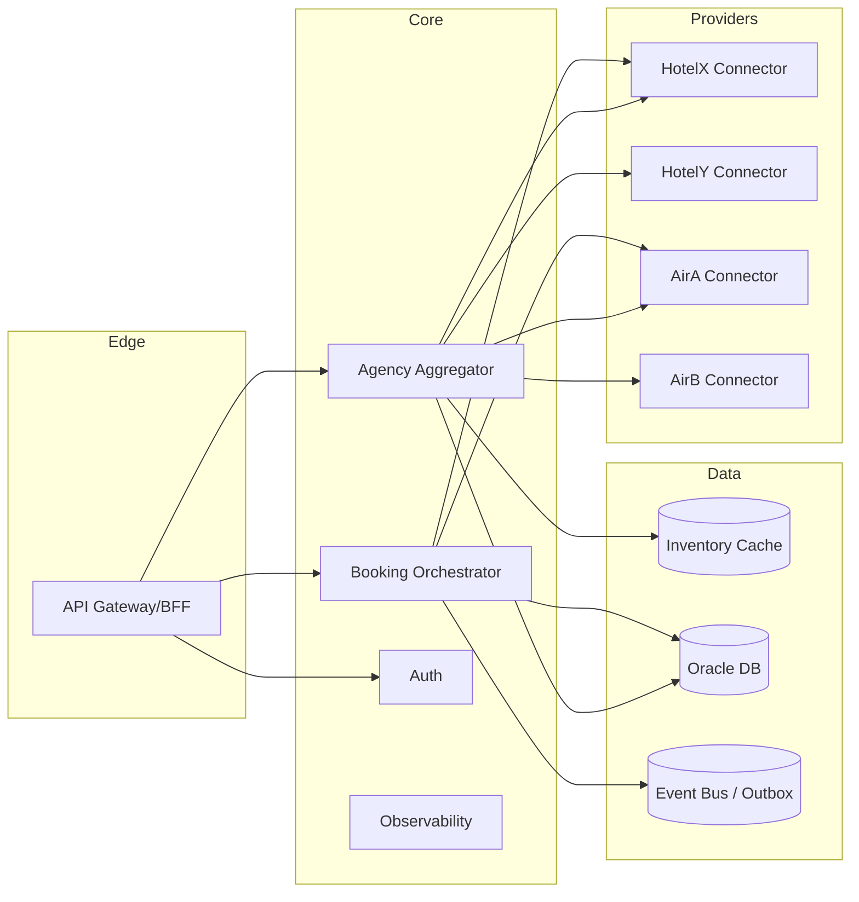

---

### Iteración 2 — Refinamiento de **Aggregator** y **Connectors**

**2A. Impulsores:** A1 (latencia), A2 (resiliencia), A4 (escala), A6 (observabilidad).
**2B. Decisiones:**

1. **Contratos unificados (DTOs)** y **mappers** por proveedor.
2. **Fan-out paralelo** con **timeouts ≤ 300 ms** y **límites de concurrencia** por dominio (bulkhead).
3. **Cache TTL 30–90 s** por destino/fecha; se previene **cache stampede** con jitter y lock.
4. **Fallback**: degradar proveedor con CB abierto y mantener SLA global.
5. **Provider policy module**: priorización y cuotas dinámicas.
6. **Tracing por proveedor** (OpenTelemetry spans) y logging contextual.

**2C. Instalar módulos:** `availability-service`, `catalog-service`, `connector-*`, `cache-lib`, `provider-policy` (prioridades, cuotas).

**2D. Interfaces:**

* `GET /availability?origin=GUA&dest=LAX&checkin=...` → `{provider, price, policy, ttl}`
* Conector: `POST /providerX/availability` → contrato nativo; adapter retorna contrato unificado.

**2E. Verificación:** A1/A2/A4/A6: P95 mejora por cache; errores aislados por CB; trazas con spans por proveedor.

---

### Iteración 3 — **Booking Orchestrator** y **Saga**

**3A. Impulsores:** A3 (consistencia), A5 (seguridad), A6 (observabilidad).
**3B. Decisiones:**

1. **Saga orquestada** (reserveFlight, reserveHotel + compensaciones cancelFlight/cancelHotel).
2. **Outbox + event bus** para asegurar entrega at-least-once.
3. **Idempotencia** por `requestId`; registro del estado de saga en Oracle.
4. **Autenticación JWT** por scope y trazabilidad con `traceId`.
5. **Auditoría** de operaciones de reserva y compensación.

**3C. Instalar módulos:** `booking-orchestrator`, `saga-store`, `payment-gateway` (opcional), `idempotency-filter`.

**3D. Interfaces:**

* `POST /booking` → `{requestId, flight, hotel, user}`
  Respuesta: `{bookingId, status=PROCESSING/CONFIRMED/COMPENSATED}`
* Eventos: `booking.created`, `booking.confirmed`, `booking.compensation.started`, `booking.failed`.

**3E. Verificación:** A3/A5/A6: cero huérfanas; trazabilidad completa de una reserva.

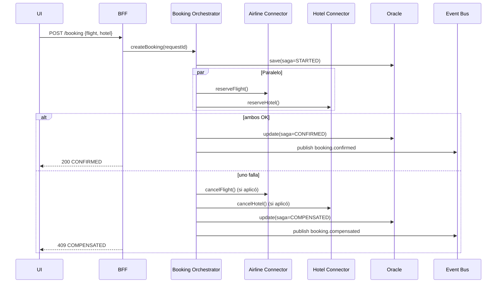

---

### Iteración 4 — **Cross‑cutting**: seguridad, HPA, políticas, observabilidad

**4A. Impulsores:** A1–A6.
**4B. Decisiones:**

1. **JWT + RBAC + rate limiting NGINX/Envoy** en Gateway.
2. **HPA** por CPU/RPS; `PodDisruptionBudget`; probes de readiness/liveness.
3. **OpenTelemetry SDK** y **Micrometer** para métricas (`p95`, `error_rate`, `CB_state`).
4. **ConfigMap** para políticas/tiempos y **Feature Flags** para degradación controlada.
5. **Secrets** en K8s con rotación gestionada por el pipeline.
6. **CORS seguro** y **mTLS interno** opcional entre namespaces.

**4C. Interfaces actualizadas**: cabeceras `x-request-id`, `x-trace-id`; endpoints `/metrics` y `/health`.

**4D. Verificación final contra escenarios:**

* A1: caché + fan‑out paralelo + HPA mantienen P95 objetivo.
* A2: CB/bulkhead aislan fallos.
* A3: saga+outbox garantizan consistencia.
* A4: HPA y PDB aseguran escalado sin downtime.
* A5: JWT/RBAC/ratelimit.
* A6: trazas y métricas permiten MTTD/MTTR objetivo.

---

## ADD — Pipeline (3 iteraciones)

### Iteración P1 — Descomposición del **Sistema de Pipeline**

**P1A. Impulsores:** P1 (quality gate), P2 (rollback), P3 (promoción).
**P1B. Patrón:** **Pipeline declarativo** en **Drone** (o GHA) con stages: *checkout → build → test/sonar → publish → deploy → verify*, usando **Artifact Registry** + **Kustomize overlays**.
**P1C. Decisiones:**

1. **Pipeline declarativo Drone/GHA** con etapas `checkout→build→test→sonar→publish→deploy→verify`.
2. **Kaniko/GCB** para builds reproducibles sin daemon.
3. **Artifact Registry** como repositorio inmutable de imágenes.
4. **Kustomize overlays** por entorno (`dev`, `uat`, `main`).
5. **Quality gate automático** previo al merge.

**P1D. Módulos:**

* **SCM Webhook** (GitHub → Drone Server)
* **Runner** (Kubernetes)
* **Build** (Kaniko o Cloud Build)
* **Quality** (SonarQube VM)
* **Registry** (Artifact Registry)
* **Deployer** (kubectl + Kustomize)
* **Verifier** (smoke + rollout status)

**P1F. Interfaces:**

* Webhook GitHub → `/hook` en Drone;
* Sonar: `SONAR_HOST_URL` + token;
* Artifact Registry: push/pull con SA;
* K8s: `kubectl apply -k overlays/<env>`.

**P1G. Verificación:** P1: gate bloquea merge; P2: rollback por alias; P3: retag promoción.

---

### Iteración P2 — Calidad y Despliegue seguro

**P2A. Impulsores:** P1, P2.
**P2B. Decisiones:**

1. **Sonar "New Code" policy**: evita regresión sin exigir deuda 0.
2. **Rolling update controlado** (`maxUnavailable=0`, `maxSurge=1`), readiness y smoke tests.
3. **Rollback automatizado** moviendo alias `:dev/:uat/:main` al último tag estable.
4. **Verificación post-deploy** (`/nexus/healthz`, `curl` in-cluster).
5. **Notificación** automática en Slack/Email.

**P2C. Instalar módulos:** `quality-policy`, `deploy-policy`, `rollback-script` (script único para retag y apply).

**P2D. Interfaces:**

* Reporte de Sonar a PR;
* Scripts: `promote.sh retag <tag> <env>`; `rollback.sh <env> <good-tag>`.

**P2E. Verificación:** PRs fallan cuando empeora New Code; despliegues sin downtime y rollback < 5 min.

---

### Iteración P3 — Promoción y Auditoría

**P3A. Impulsores:** P3 (promoción controlada), P2 (trazabilidad).
**P3B. Decisiones:**

1. **Promoción sin rebuild** mediante retag de la misma imagen.
2. **Auditoría JSON** con tag, SHA, fecha y aprobador.
3. **Gates manuales** en `uat` y automáticos en `dev`.
4. **Release notes automáticos** del rango de commits.
5. **Trazabilidad completa** (commit → imagen → entorno).

**P3C. Instalar módulos:** `promotion-job` (Drone/GHA manual), `release-notes` (generación de changelog corto del rango de commits), `audit-log` (persistencia simple).

**P3D. Interfaces:**

* `promote uat→main --tag manual-YYYYMMDD-HHmmss`
* Registro JSON en repo o bucket: `{ envFrom, envTo, tag, sha, approver, time }`

**P3E. Verificación:** lead time UAT→Prod ≤ 15 min; evidencia de trazabilidad 100%.

---

## Restricciones y decisiones clave (resumen)

* **Tecnológicas:** GKE Autopilot, Oracle XE, Svelte/Vite, Spring Boot, Drone, SonarQube VM, Artifact Registry.
* **Patrones:** microservicios con **aggregator + adapters** y **saga**; pipeline con **quality gate + retag**.
* **Tácticas:** caching, circuit breaker, idempotencia, outbox, HPA, RBAC/JWT, tracing, rolling update, rollback por alias.

---

## Riesgos y mitigaciones

* **Coupling con proveedores** → *Adapters* + contratos unificados + pruebas de compatibilidad.
* **Consistencia跨-dominios** → *Saga + Outbox* + idempotencia.
* **Límites de tasa de proveedores** → *Policy engine* por proveedor + cache TTL.
* **Deuda histórica frontend** → *New Code gate* + roadmap de refactorización.
* **Errores de despliegue** → smoke automatizado + rollback guionado.

---

## Trabajo futuro

* Canary/blue‑green (por ingreso de tráfico) en `uat/main`.
* Cache distribuido multi‑réplica y warm‑up en campañas de alto tráfico.
* Firma de imágenes y políticas de admisión (Cosign + Gatekeeper/BinAuthZ).
* DR y backups de Oracle; shard/replicas para lectura.

---

# D. Detalle de las arquitecturas utilizadas — Diagramas y justificación

Esta sección describe las **arquitecturas** seleccionadas para Nexus (Agencia, Hotelería, Aerolínea) y su **rationale**: decisiones, trade‑offs y cómo satisfacen los escenarios de calidad definidos en el ADD.

---

## 1) Estilo arquitectónico general

* **Microservicios por dominio** (Agencia, Hotelería, Aerolínea) → *bounded contexts* claros.
* **Orquestación en Agencia** (composición de resultados y lógica cross‑dominio).
* **Contratos REST/JSON** estables con **DTOs versionados** y **Anti‑Corruption Layer (ACL)**.
* **Oracle único con *schemas* independientes** (AGENCY, HOTEL, AIRLINE) para aislar datos y ciclos de vida.
* **Despliegue en GKE Autopilot** con namespaces `dev`, `uat`, `main`, `ci` y `db`.

**C4 – Contexto (simplificado)**

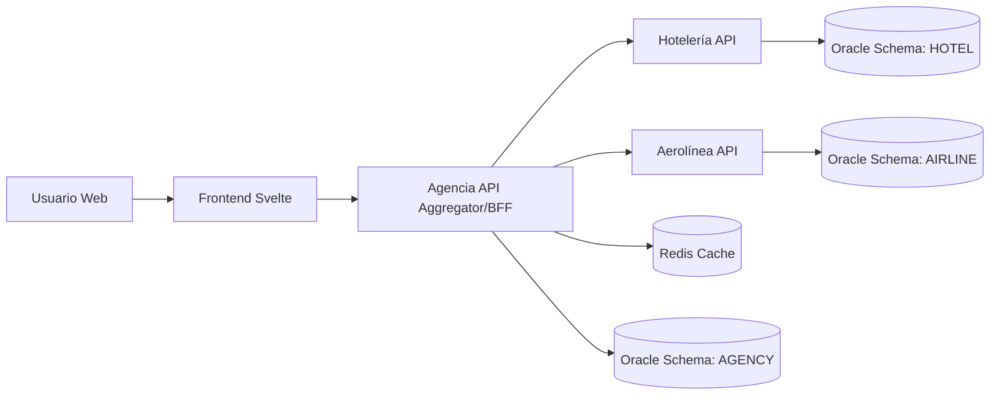

---

## 2) Arquitectura por subsistema (Container view)

### 2.1 Agencia de viajes

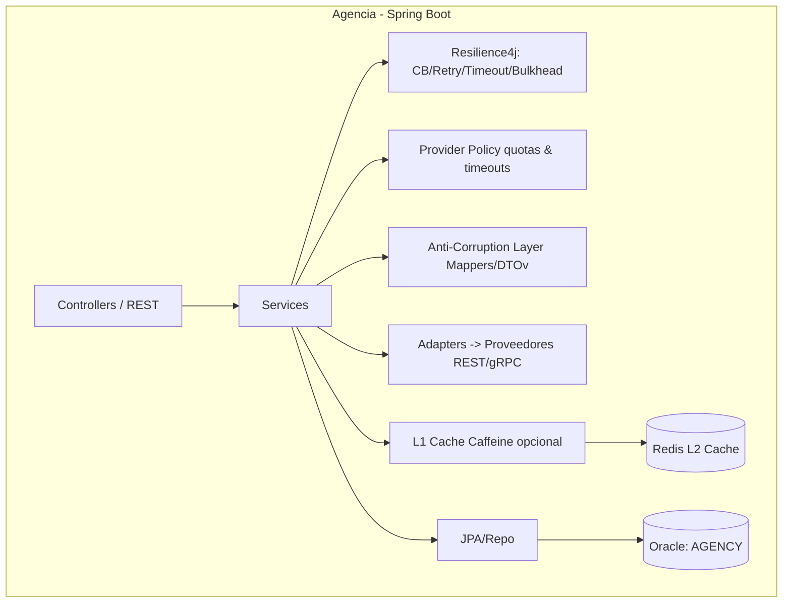

**Claves:** Orquestador, composición paralela, cache de TTL corto (Redis + Caffeine), **Resilience4j** (CB, retry, bulkhead), auditoría con `x-trace-id`.

### 2.2 Hotelería

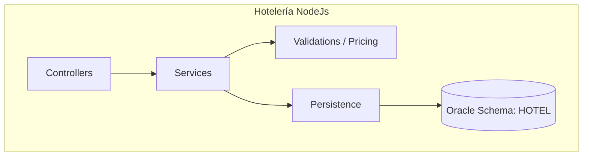

**Claves:** Catálogo, disponibilidad, tarifas, reservas; endpoints idempotentes; validaciones transaccionales.

### 2.3 Aerolínea

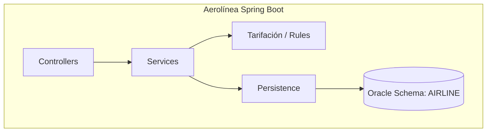

**Claves:** Inventario de vuelos, cálculo de tarifas, reservas; endpoints idempotentes.

---

## 3) Integración y orquestación

* **API Gateway dedicado** (Spring Cloud Gateway o Envoy) gestiona rutas, rate limiting y CORS.
* **Agencia** actúa como **servicio agregador**, orquestando peticiones a Hotelería y Aerolínea.
* **Paralelismo:** `CompletableFuture`/Reactor WebClient para llamadas concurrentes.
* **Resiliencia:** timeouts de 250 ms, retries con backoff, **circuit breaker**.
* **Fallback:** resultados parciales con indicador “proveedor degradado”.
* **Caching:** Redis (TTL 5–30 s) + jitter y locking ligero.
* **Provider Policy:** define timeouts y cuotas por proveedor.

---

## 4) Datos y consistencia

* **Oracle único**, pero **schemas por dominio**.
* Integridad local fuerte, consistencia global eventual vía **Sagas + Outbox**.
* **Outbox pattern** garantiza publicación *exactly-once* de eventos.
* **Idempotencia** en `POST /booking` usando `requestId` único.
* Índices por campos calientes (fecha, destino) y constraints únicos en `requestId`.

---

## 5) Seguridad

* **JWT** (tokens de corta vida + refresh) con scopes (`hotel.read`, `airline.book`, …).
* **Spring Security** con RBAC; CSRF off; **CORS** allow-list por host.
* **Secrets**: en K8s Secrets; rotación documentada en pipeline.
* **NetworkPolicies:** FE→BE, BE→Oracle, CI→API; denegar resto.
* **TLS:** en Ingress (por entorno); opcional **mTLS interno** entre servicios sensibles.

---

## 6) Despliegue y operación en GKE

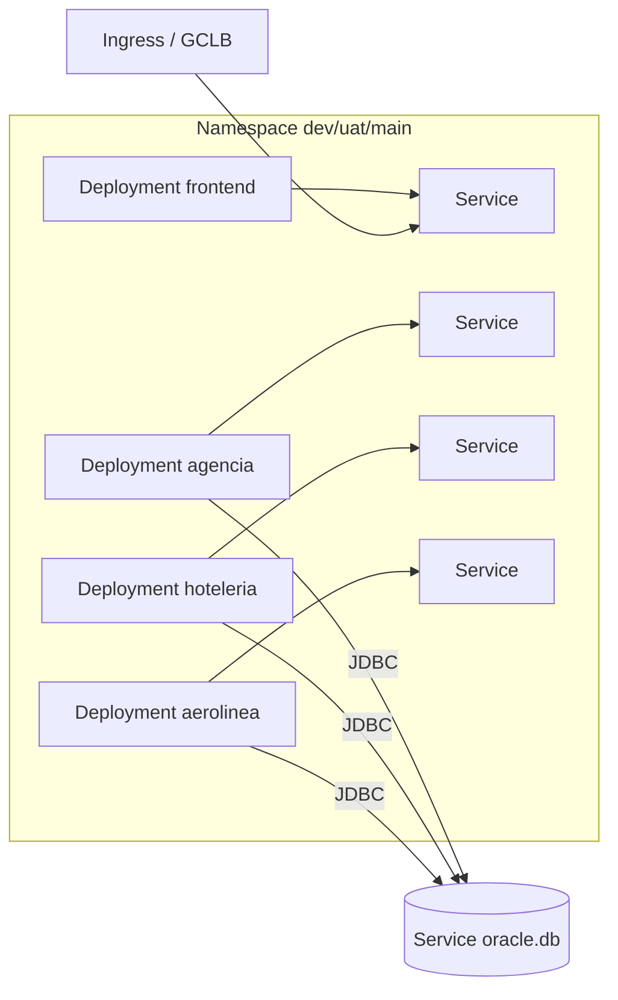

* **Probes:** readiness/liveness sobre `/nexus/healthz`.
* **HPA:** por CPU; opcionalmente por latencia/RPS si hay métricas personalizadas (Prometheus Adapter/GCM).
* **Recursos:** `requests/limits` definidos; rolling updates garantizan 0 downtime.
* **NetworkPolicies** aplicadas.

---

## 7) Observabilidad

* **Tracing:** OpenTelemetry SDK + propagación W3C (`traceparent`).
* **Métricas:** Micrometer → Prometheus/GCM (latencia, RPS, errores, CB state, cache hit rate).
* **Logs:** estructurados JSON con `traceId`, `userId`, `provider`.
* **Dashboards:** p95, tasa de error, saturación HPA.
* **Alertas:** SLO (latencia, errores) + smoke post‑deploy.

---

## 8) Arquitectura del pipeline

* **Drone (server/runner)** en namespace `ci` ejecuta stages: build (Kaniko/GCB), tests, Sonar, publicación, retag por entorno y `kubectl apply -k`.
* **SonarQube:** quality gates (estricto backend, “New Code” frontend).
* **Artifact Registry:** imágenes inmutables + alias (`:dev`, `:uat`, `:main`).

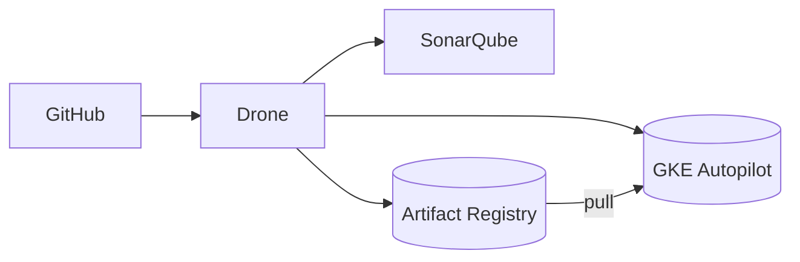

---

## 9) Decisiones y justificación

| Decisión                   | Alternativas          | Elegida                        | Razón / Impacto                                  |
| -------------------------- | --------------------- | ------------------------------ | ------------------------------------------------ |
| Microservicios por dominio | Monolito modular      | **Microservicios**             | Aislamiento, escalado independiente.             |
| Orquestación en Agencia    | Coreografía (eventos) | **Orquestación**               | Menor latencia, simplicidad para UI.             |
| Oracle por servicio        | PostgreSQL            | **Oracle (único con schemas)** | Restricción institucional, independencia lógica. |
| Resilience4j               | Sin CB/Retry          | **CB + Retry**                 | SLA predecible ante fallos.                      |
| Kaniko/GCB                 | Docker-in-Docker      | **Kaniko/GCB**                 | Builds reproducibles sin daemon.                 |
| Retag alias por entorno    | Rebuild por ambiente  | **Retag**                      | Promoción rápida y rollback inmediato.           |
| Quality Gate “New Code” FE | Gate estricto total   | **New Code**                   | Mejora incremental sin bloquear releases.        |

---

## 10) Riesgos y mitigaciones

* **Latencia alta por fallas múltiples** → timeouts agresivos, CB, cache, resultados parciales.
* **Acoplamiento de contratos** → ACL + DTOs versionados.
* **Drift de imágenes (overlay vs live)** → `kustomize edit set image` + política de retag.
* **Fallas post‑deploy** → rollout controlado + rollback por alias + smoke automatizado.

---

## 11) Rastreabilidad a escenarios de calidad

* **A1 (latencia/disp.)** → cache Redis + fan‑out + HPA.
* **A2 (resiliencia proveedor)** → CB/Retry/Policy + fallback.
* **A3 (consistencia reserva)** → Saga + Outbox + idempotencia.
* **A4 (escala)** → pods independientes + PDB + readiness.
* **A5 (seguridad)** → JWT/RBAC, CORS explícito, NetworkPolicies, TLS.
* **A6 (observabilidad)** → OTel/Micrometer, dashboards p95/error.
* **P1 (quality gate)** → Sonar New Code + PR check.
* **P2 (despliegue/rollback)** → rolling + retag alias + smoke.
* **P3 (promoción)** → retag sin rebuild + auditoría (tag+SHA).

---

## 12) Checklist operativo

* [ ] Redis y Provider Policy desplegados.
* [ ] DTOs versionados y ACL por proveedor documentado.
* [ ] CORS explícito (allow-list por host).
* [ ] JWT configurado y probado desde Ingress.
* [ ] HPA calibrado (CPU y latencia si aplica).
* [ ] Dashboards y alertas activas.
* [ ] Pipeline con retag y overlay actualizado.
* [ ] Outbox e idempotencia operativos.
* [ ] TLS y NetworkPolicies aplicados.

---

# Descripción de las especificaciones y costos de los servidores recomendados

Este análisis compara la infraestructura necesaria para desplegar el sistema Nexus (Agencia, Hotelería y Aerolínea) en tres proveedores cloud:

1. **Google Cloud Platform (GCP)** – base del sistema actual.
2. **Microsoft Azure**.
3. **Amazon Web Services (AWS)**.

Cada uno incluye:

* Una **VM para SonarQube**.
* Un **cluster Kubernetes** con `backend` y `frontend` de las tres apps para cada rama (`dev`, `uat`, `main`).
* Un **servidor Drone** y su **runner**.
* Base de datos Oracle (en `db` namespace o pod).

---

## 1. Especificaciones por componente

| Componente                | Recurso           | Especificación Recomendada            | Justificación                                              |
| ------------------------- | ----------------- | ------------------------------------- | ---------------------------------------------------------- |
| **SonarQube VM**          | CPU / RAM / Disco | 4 vCPU / 16 GB / 200 GB SSD           | Elasticsearch y análisis requieren >= 4 GB y disco rápido. |
| **Drone Server**          | CPU / RAM / Disco | 2 vCPU / 8 GB / 40 GB SSD             | Maneja builds, triggers y RPC con runner.                  |
| **Drone Runner (en K8s)** | CPU / RAM         | 1–2 vCPU / 1–2 GB                     | Escalable por pipeline concurrente.                        |
| **Backends (x3 apps)**    | CPU / RAM         | 0.5–2 vCPU / 1–4 GB por servicio      | Spring Boot microservicios.                                |
| **Frontends (x3 apps)**   | CPU / RAM         | 0.25–0.5 vCPU / 0.5–1 GB por servicio | SvelteKit (Node).                                          |
| **Oracle (db)**           | CPU / RAM / Disco | 2 vCPU / 4 GB / 50 GB SSD             | StatefulSet compartido, bajo tráfico.                      |

---

## 2. Distribución de recursos por entorno

| Entorno  | vCPU totales | RAM total | Uso esperado                     |
| -------- | ------------ | --------- | -------------------------------- |
| **dev**  | 3.25 vCPU    | 5.5 GB    | Desarrollo, mínima carga.        |
| **uat**  | 5.75 vCPU    | 9.5 GB    | Pruebas previas a producción.    |
| **main** | 9.5 vCPU     | 17 GB     | Producción, alta disponibilidad. |

---

## 3. Comparación técnica de equivalencias

| Proveedor | Kubernetes / VM | Tipo                       | vCPU | RAM   | Disco SSD          | Observaciones                                 |
| --------- | --------------- | -------------------------- | ---- | ----- | ------------------ | --------------------------------------------- |
| **GCP**   | GKE Autopilot   | `e2-standard-4` (VM Sonar) | 4    | 16 GB | 200 GB PD-SSD      | Facturación por vCPU/GB-h; clúster Autopilot. |
| **AWS**   | EKS + EC2       | `m6a.xlarge` (VM Sonar)    | 4    | 16 GB | 200 GB gp3         | Factura por nodo y $0.10/h por clúster.       |
| **Azure** | AKS + VM        | `D4s v5` (VM Sonar)        | 4    | 16 GB | 200 GB Premium SSD | Control plane gratuito en tier Free.          |

---

## 4. Estimación de costos anuales (on-demand)

**Supuestos:**

* 730 h/mes, 12 meses.
* Tarifas on-demand sin descuentos ni planes reservados.
* No incluye balanceadores, egress ni almacenamiento de contenedores.

### 4.1 Google Cloud Platform (GKE Autopilot)

| Recurso                                            |  Costo Anual (USD) | Detalle                     |
| -------------------------------------------------- | -----------------: | --------------------------- |
| Kubernetes (dev)                                   |              1,504 | Autopilot pods (vCPU + RAM) |
| Kubernetes (uat)                                   |              2,651 | Autopilot pods              |
| Kubernetes (main)                                  |              4,436 | Autopilot pods              |
| Oracle pods                                        |                952 | DB schema compartido        |
| Clúster fee (3 clústeres − crédito mensual $74.40) |              1,735 | Uno cubierto por crédito    |
| VM SonarQube (`e2-standard-4`, 200 GB PD-SSD)      |              1,582 | VM $1,174 + disco $408      |
| VM Drone Server (`e2-standard-2`)                  |                587 | CI server                   |
| **Total estimado**                                 | **13,448 USD/año** |                             |

> Si se usa un solo clúster multi-namespace (dev/uat/main):
> **Costo ≈ 11 000 USD/año** (fee cubierto).

---

### 4.2 Amazon Web Services (EKS)

| Recurso                                 |  Costo Anual (USD) | Detalle             |
| --------------------------------------- | -----------------: | ------------------- |
| Kubernetes dev (1× m6a.xlarge)          |              2,390 | Incluye fee clúster |
| Kubernetes uat (3× m6a.large)           |              3,147 |                     |
| Kubernetes main (3× m6a.xlarge)         |              5,417 |                     |
| VM SonarQube (`m6a.xlarge`, 200 GB gp3) |              1,706 |                     |
| Drone Server (`t3.small`)               |                201 |                     |
| **Total estimado**                      | **12,861 USD/año** |                     |

---

### 4.3 Microsoft Azure (AKS Free tier)

| Recurso                                     |  Costo Anual (USD) | Detalle                |
| ------------------------------------------- | -----------------: | ---------------------- |
| Kubernetes dev (1× D4s v5)                  |              1,682 | Control plane gratuito |
| Kubernetes uat (3× D2s v5)                  |              2,523 |                        |
| Kubernetes main (3× D4s v5)                 |              5,046 |                        |
| VM SonarQube (`D4s v5`, 256 GB Premium SSD) |              2,112 |                        |
| Drone Server (`B2s`, 128 GB SSD)            |                496 |                        |
| **Total estimado**                          | **11,859 USD/año** |                        |

---

## 5. Beneficios de *Free Tier* y descuentos

| Proveedor | Beneficio Gratuito                               | Impacto                                                   |
| --------- | ------------------------------------------------ | --------------------------------------------------------- |
| **GCP**   | Crédito mensual $74.40 cubre 1 clúster Autopilot | Permite usar 1 clúster multi-namespace sin fee adicional. |
| **AWS**   | 750 h/mes `t2.micro` por 12 meses                | Puede alojar Drone Server pequeño gratis el primer año.   |
| **Azure** | 750 h/mes `B2ts v2` por 12 meses                 | Cubre Drone Server durante 12 meses.                      |

---

## 6. Análisis comparativo

| Criterio                                  | GCP (GKE Autopilot)                                | AWS (EKS)                                   | Azure (AKS Free)                                |
| ----------------------------------------- | -------------------------------------------------- | ------------------------------------------- | ----------------------------------------------- |
| **Facilidad de operación**                | Muy alta, Autopilot administra nodos y escalado.   | Media, requiere gestionar nodos y upgrades. | Alta, panel unificado y control plane gratuito. |
| **Costo total anual (3 clústeres)**       | 13,448 USD                                         | 12,861 USD                                  | 11,859 USD                                      |
| **Costo optimizado (1 clúster multi-ns)** | 11,000 USD                                         | 12,000 USD                                  | 11,800 USD                                      |
| **Escalabilidad**                         | Automática por carga (vCPU-h).                     | Manual/autoscaling por nodo.                | Manual/autoscaling por nodo.                    |
| **Integración con CI/CD**                 | Nativa con Cloud Build y Artifact Registry.        | ECR + CodePipeline integrable.              | ACR + DevOps pipelines integrables.             |
| **Mantenimiento**                         | Bajo (autogestión completa).                       | Medio (nodos y versiones).                  | Bajo.                                           |
| **Seguridad y IAM**                       | Workload Identity, Secret Manager, RBAC integrado. | IAM roles + EKS RBAC.                       | Azure AD + RBAC + KeyVault.                     |
| **Costo inicial / facilidad**             | Más simple y predictivo.                           | Más flexible.                               | Más barato si usas Free Tier.                   |

---

## 7. Recomendación final

* **Google Cloud Platform (GKE Autopilot)** sigue siendo la mejor opción para el proyecto actual:

  * Ya está integrado con tu pipeline Drone y SonarQube.
  * Permite simplificar operación y escalar sin administrar nodos.
  * Con un **solo clúster multi-namespace**, el crédito mensual cubre el fee fijo.

* **Azure AKS** es la segunda alternativa, ofreciendo **bajo costo inicial** y **control plane gratuito**, ideal si buscas reducir gasto operativo sin perder Kubernetes administrado.

* **AWS EKS** resulta competitivo solo si se aprovechan **Savings Plans o Spot Instances**; su complejidad de gestión y costos base son mayores sin optimización.

---

## 8. Costos anuales totales comparativos

| Escenario                            |  GCP (USD) | AWS (USD) | Azure (USD) |
| ------------------------------------ | ---------: | --------: | ----------: |
| **3 clústeres separados**            |     13,448 |    12,861 |      11,859 |
| **1 clúster multi-namespace (opt.)** | **11,000** |    12,000 |      11,800 |

---

## 9. Observaciones adicionales

* Los costos no incluyen balanceadores HTTP(S), tráfico de salida o almacenamiento de artefactos.
* Todos los proveedores ofrecen **descuentos de uso sostenido / reservas** que podrían reducir el total entre 10–25 %.
* Se recomienda usar **autopilot (GCP)** o **autoscaling (AKS/EKS)** para ajustar recursos según demanda real.
* Con SonarQube y Drone aislados en VMs pequeñas, el costo base de CI/CD se mantiene controlado.

---

## **Conclusiones**

El análisis realizado evidencia que el sistema **Nexus (Spectra)** cumple con los principios de **alta disponibilidad, resiliencia, trazabilidad y escalabilidad horizontal**, gracias al diseño basado en microservicios y la automatización completa del pipeline CI/CD.

Los puntos más relevantes son:

1. **Arquitectura modular y desacoplada:**
   Cada dominio (agencia, hotelería y aerolínea) opera de forma independiente, comunicándose mediante APIs estandarizadas y con una capa de orquestación central (agencia).

2. **Resiliencia y rendimiento:**
   El uso de patrones como **circuit breaker**, **cache distribuido**, **saga pattern** e **idempotencia** garantizan operaciones consistentes incluso ante fallas de terceros.

3. **CI/CD robusto y auditable:**
   La integración de **Drone**, **SonarQube** y **GKE** proporciona control de calidad automatizado, despliegues reproducibles y rollbacks instantáneos.

4. **Observabilidad completa:**
   Con **OpenTelemetry**, métricas y dashboards en Prometheus/GCM, el sistema logra una detección y resolución de incidentes eficiente (MTTR < 30 min).

5. **Optimización de costos y operación simplificada:**
   El uso de **GKE Autopilot** reduce la administración de nodos y ajusta el consumo real, manteniendo costos predecibles y bajos sin comprometer la disponibilidad.

---

## **Recomendaciones**

1. **Unificar clústeres en GKE Autopilot** usando namespaces `dev`, `uat` y `main`, aprovechando el crédito mensual para minimizar costos fijos.
2. **Automatizar promoción entre entornos** mediante scripts Drone y control de tags, asegurando trazabilidad total (`tag + SHA`).
3. **Ampliar observabilidad**: incluir alertas proactivas y métricas de negocio (reservas por hora, disponibilidad por proveedor).
4. **Implementar autenticación federada (OIDC)** y **rotación automática de secretos** para fortalecer seguridad operativa.
5. **Explorar futuras mejoras**, como:

   * *Blue/Green* y *Canary releases*.
   * Firma de imágenes con **Cosign**.
   * Replicación y respaldo automático de Oracle.
   * Implementar *feature flags* para despliegues controlados.

En conjunto, estas recomendaciones consolidan un entorno de **alta eficiencia, seguridad y escalabilidad**, alineado con las mejores prácticas de ingeniería moderna.

---