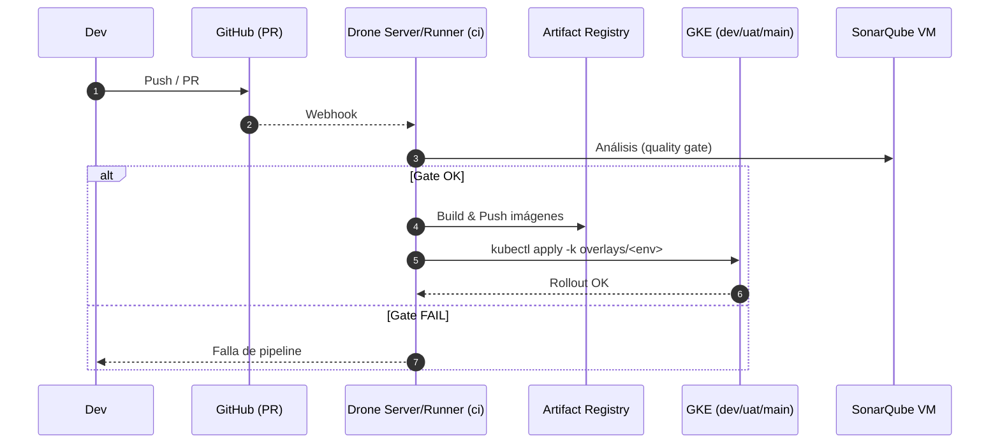
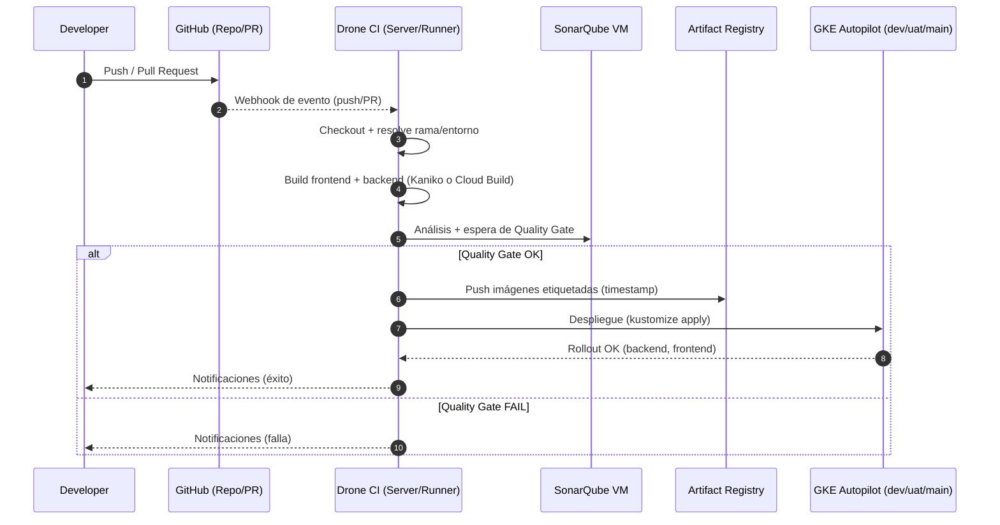
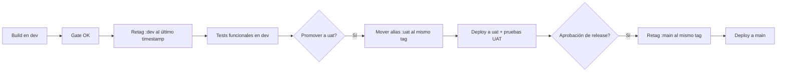
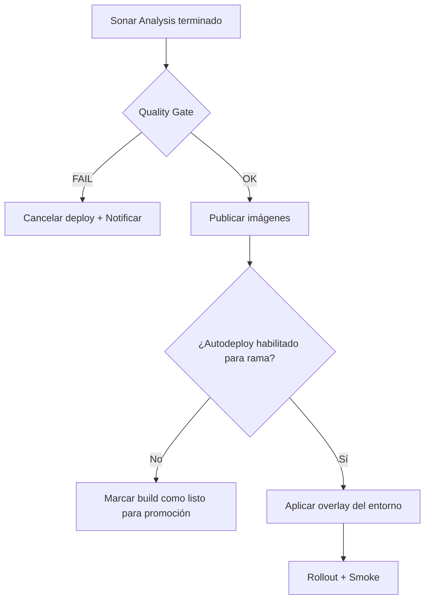
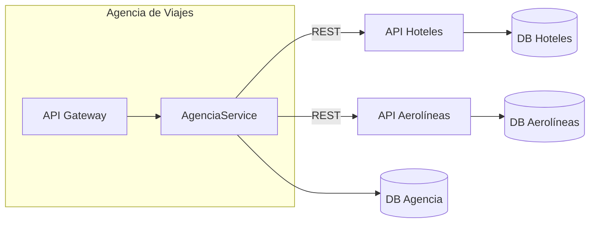
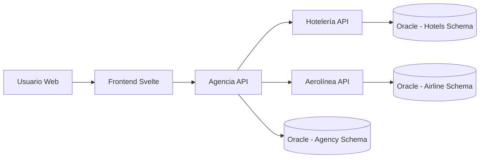
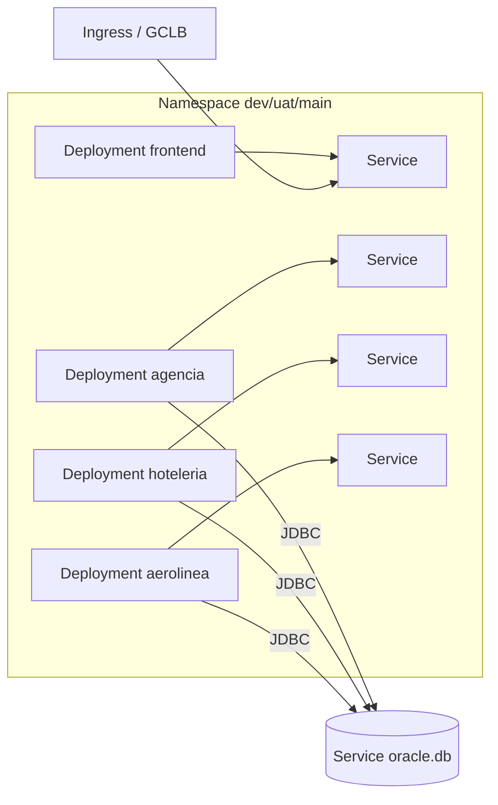
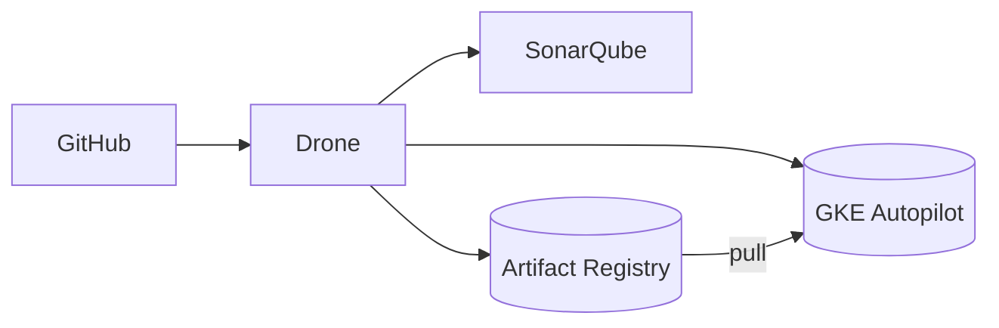

# A. Diagrama general del sistema — Nexus (Spectra)

Este diagrama resume cómo se relacionan los actores externos (usuarios, GitHub), la **infraestructura en GCP** (GKE Autopilot, Artifact Registry, VM de SonarQube) y los **componentes de la app** (frontend, backend, Oracle) a través de namespaces (`dev`, `uat`, `main`, `ci`, `db`).

---

## 1) Vista general (alto nivel)

```mermaid
graph LR
  %% Actores externos
  U[Usuarios / Navegador]:::ext
  GH[GitHub<br/>Repos & PRs]:::ext
  AR[(Artifact Registry)]:::gcp
  SONAR[(VM SonarQube<br/>Docker Compose)]:::gcp

  %% Borde de GKE
  subgraph GKE[GKE Autopilot - cluster "spectra-autopilot"]
    direction TB

    %% Ingress / LB
    GCLB[HTTP(S) Load Balancer<br/>+ Ingress/NEG]:::net

    %% Namespaces de runtime
    subgraph NS_MAIN[main]
      direction TB
      MFE[frontend]:::fe --> MBE[backend]:::be
    end

    subgraph NS_UAT[uat]
      direction TB
      UFE[frontend]:::fe --> UBE[backend]:::be
    end

    subgraph NS_DEV[dev]
      direction TB
      DFE[frontend]:::fe --> DBE[backend]:::be
    end

    %% Base de datos central
    subgraph NS_DB[db]
      ORA[(Oracle XE<br/>StatefulSet + PVC)]:::db
    end

    %% Namespace de CI
    subgraph NS_CI[ci]
      DRONE[Drone Server]:::ci
      DRONER[Drone Runner (Kube)]:::ci
      DRONE -- RPC --> DRONER
    end

  end

  %% Flujo de tráfico de usuarios
  U -->|HTTP/HTTPS| GCLB
  GCLB -->|Rutas / Hostnames| DFE
  GCLB -->|Rutas / Hostnames| UFE
  GCLB -->|Rutas / Hostnames| MFE

  %% App internamente
  DFE --> DBE -->|JDBC| ORA
  UFE --> UBE -->|JDBC| ORA
  MFE --> MBE -->|JDBC| ORA

  %% CI/CD
  GH -->|Webhooks / PR| DRONE
  DRONER -->|Build & Push| AR
  AR -->|Pull images| DBE
  AR -->|Pull images| UBE
  AR -->|Pull images| MBE
  AR -->|Pull images| DFE
  AR -->|Pull images| UFE
  AR -->|Pull images| MFE

  %% Calidad
  DRONER -->|Análisis Sonar (backend/frontend)| SONAR

  classDef ext fill:#f6f6f6,stroke:#999,stroke-width:1px
  classDef gcp fill:#f0f9ff,stroke:#3b82f6,stroke-width:1px
  classDef net fill:#ecfdf5,stroke:#10b981,stroke-width:1px
  classDef fe fill:#fff7ed,stroke:#fb923c,stroke-width:1px
  classDef be fill:#fef2f2,stroke:#ef4444,stroke-width:1px
  classDef db fill:#f5f3ff,stroke:#8b5cf6,stroke-width:1px
  classDef ci fill:#eef2ff,stroke:#6366f1,stroke-width:1px
```

**Leyenda rápida**

* **GCLB/Ingress**: entrada única desde Internet; enruta por host/path a cada *frontend* (según `dev/uat/main`).
* **Frontend** (*SvelteKit*) llama a **Backend** (*Spring Boot*) vía `/nexus/*`.
* **Backend** usa **Oracle** (namespace `db`) vía JDBC; un solo clúster DB compartido.
* **Drone** (namespace `ci`) orquesta *pipelines*; invoca análisis SonarQube en la **VM**.
* **Artifact Registry** aloja imágenes de `frontend`/`backend`; los Deployments hacen *pull*.

---

## 2) Vista de despliegue por namespace (patrón repetible)

```mermaid
graph TB
  subgraph "Namespace (ej. dev)"
    direction TB
    FE[Deployment: frontend]\nService: ClusterIP\n(HEALTH: /nexus/healthz)
    BE[Deployment: backend]\nService: ClusterIP\n(8080)
    ORA[(Service: oracle.db.svc)]

    FE -->|HTTP (in-cluster)| BE
    BE -->|JDBC| ORA
  end

  IGW[Ingress / NEG / LB]
  IGW -->|Host/Path -> FE| FE
```

**Notas**

* Ingress publica dominios/paths por entorno; cada `frontend` expone el *site*.
* `PUBLIC_BACKEND_URL=/nexus` fija el *base path* para llamadas al backend.

---

## 3) Vista de flujo CI/CD (resumen)



**Variantes de build**

* **Kaniko (in-cluster)** o **Cloud Build (GCB)** pueden generar y *pushear* imágenes al **Artifact Registry**.
* Las *overlays* de Kustomize fijan las imágenes por entorno para despliegues reproducibles.

---

## 4) Componentes clave

* **GKE Autopilot**: clúster administrado (control plane y nodos bajo demanda).
* **Namespaces**: `dev`, `uat`, `main` (runtime), `db` (Oracle), `ci` (Drone).
* **Ingress / GCLB**: entrada HTTP(S) con NEG por Service.
* **Frontend**: Svelte/Vite, despliegue por entorno, variables `PUBLIC_BACKEND_URL`.
* **Backend**: Spring Boot, expone `/nexus/*`, health `/nexus/healthz`.
* **Oracle XE**: StatefulSet + PVC (persistencia), Service estable para JDBC.
* **Artifact Registry**: almacenamiento de imágenes versionadas (tags por entorno o timestamp).
* **Drone**: orquestación CI/CD en `ci`; ejecuta análisis Sonar y despliegue.
* **SonarQube VM**: análisis estático, métricas, *quality gates*.

---

## 5) Suposiciones y límites de esta vista

* **Un solo** Oracle compartido por `dev/uat/main`. Si se aísla por entorno, se replicaría el patrón en más namespaces.
* Seguridad, observabilidad (GCM/Prometheus), *secrets* y *ingress domains* se detallarán en secciones B–D.
* El diagrama muestra **paths típicos**; reglas de *network policy*, *HPA*, *autoscaling* y *backup* se documentarán en D.

# B. Definición, explicación y diagramas del **pipeline**

Esta sección documenta el **ciclo de entrega** de Nexus (Spectra): desde el *push/PR* hasta el despliegue en **GKE Autopilot**, pasando por **quality gates** en SonarQube y publicación de imágenes en **Artifact Registry**. Se cubren variantes de build (**Kaniko** in‑cluster y **Cloud Build**), la estrategia por ramas (**dev / uat / main**), promoción, rollback y pre/post‑checks.

---

## 1) Resumen del flujo (alto nivel)



---

## 2) Triggers y estrategia por ramas

| Rama   | Entorno destino     | Tipo de ejecución         | Despliegue              |
| ------ | ------------------- | ------------------------- | ----------------------- |
| `dev`  | Namespace **dev**   | PRs/Merges a `dev`        | Automático tras Gate OK |
| `uat`  | Namespace **uat**   | Merge desde `dev`         | Automático tras Gate OK |
| `main` | Namespace **main`** | Release/Merge desde `uat` | Automático tras Gate OK |

**Notas**

* El pipeline corre en **cada push/PR**; el **despliegue** se ejecuta solo en ramas protegidas o cuando la política lo permita (ej. sólo tras merge).
* Las **overlays Kustomize** fijan la imagen por entorno; evitamos drift usando `kustomize edit set image` o *retag* del alias (`:dev`, `:uat`, `:main`).

---

## 3) Etapas del pipeline (detalle)

```mermaid
flowchart TB
  A[Trigger: push/PR] --> B[Checkout + Metadata]
  B --> C[Resolver estrategia de build
  - Kaniko in-cluster
  - Cloud Build (GCB)]
  C --> D[Build backend]
  C --> E[Build frontend]
  D --> F[Unit tests + Coverage]
  F --> G[Sonar analysis (backend)
  - sonar.qualitygate.wait=true]
  E --> H[Sonar analysis (frontend)
  (opcional o "New Code" only)]
  G --> I{Quality Gate OK?}
  H --> I
  I -->|No| X[Fail + Notificar]
  I -->|Sí| J[Tag y push imágenes
  - :manual-YYYYMMDD-HHMMSS
  - mover alias :dev/:uat/:main]
  J --> K[Pin de imágenes en overlay
  - kustomize edit set image
  (si aplica)]
  K --> L[Aplicar manifests
  - kubectl apply -k overlays/<env>]
  L --> M[Rollout status
  - backend
  - frontend]
  M --> N[Smoke tests
  - /nexus/healthz
  - curl desde Pod]
  N --> O[Notificar resultado]
```

### 3.1 Checkout & Metadata

* Obtiene **SHA**, **rama**, y determina **entorno** (`dev`, `uat`, `main`).
* Calcula **STAMP** (`YYYYMMDD-HHmmss`) para etiquetar imágenes inmutables.

### 3.2 Build de imágenes

* **Kaniko (in-cluster)**: runner de Drone ejecuta contenedor Kaniko y *pushea* a Artifact Registry sin daemon Docker.
* **Cloud Build (GCB)**: dispara `gcloud builds submit` (por carpeta o config YAML) para construir y publicar.

### 3.3 Tests + SonarQube

* Backend: `./gradlew test jacocoTestReport sonar -Dsonar.qualitygate.wait=true`.
* Frontend: análisis opcional / enfoque **New Code** (evita frenar por deuda histórica; ver sección de políticas).

### 3.4 Versionado y publicación

* Empujar `nexus-backend:nombre:manual-$STAMP` y `nexus-frontend:manual-$STAMP`.
* **Promoción por alias**: mover `:dev` / `:uat` / `:main` al tag recién publicado (evita re‑render de Kustomize).

### 3.5 Despliegue (CD)

* Opción A: `kubectl apply -k k8s/overlays/<env>` (manifestos fuente‑de‑verdad).
* Opción B: solo `kubectl set image ...` **+** actualizar overlay con `kustomize edit set image` para que futuros apply no reviertan.

### 3.6 Verificación

* `kubectl -n <env> rollout status deploy/backend|frontend`.
* Smoke check: `curl http(s)://<LB>/nexus/healthz` y `curl in-cluster` al Service.

### 3.7 Notificaciones

* Éxito/falla a email (Gmail), GitHub PR checks y/o chat.

---

## 4) Artefactos, registros y configuración

* **Artifact Registry**: repos `nexus-backend`, `nexus-frontend`.
* **Etiquetas**: inmutables por timestamp; alias mutables por entorno (`:dev`, `:uat`, `:main`).
* **Manifests**: `k8s/base` + `k8s/overlays/{dev,uat,main}` (env, replicas, vars, probes, etc.).
* **Variables**: `PUBLIC_BACKEND_URL=/nexus` en frontend; JDBC/credenciales en backend vía `ConfigMap`/`Secret`.

---

## 5) Políticas de calidad y *gates*

* **Gate estricto en backend**: el job falla si el **Quality Gate** falla (mantenibilidad, cobertura mínima, vulnerabilidades).
* **Deuda histórica en frontend**: usar **"New Code"** en Sonar (comparación con base de PR/último *clean baseline*) para **solo fallar si empeora** (issues/coverage nuevos). Esto permite mejora gradual.
* **Pull Request decoration**: comentarios de Sonar en PR con issues, hotspots y cobertura.

> *Implementación práctica:* en Sonar definir "New Code" como *desde la rama base* o *desde una fecha*. Ajustar Quality Gate (condiciones en **New Code**) y opcionalmente relajar condiciones en Overall Code para frontend.

---

## 6) Promoción y release management



* **Sin rebuild** en promociones: sólo mover alias del **mismo tag** probado.
* Auditoría de promociones: registrar tag inmutable + commit SHA en los releases.

---

## 7) Rollback (rápido y reproducible)

1. **Alias back**: mover `:dev/:uat/:main` al **último tag conocido bueno**.
2. (Si se usó apply de Kustomize) **Actualizar overlay** con `kustomize edit set image` al tag bueno para que no se revierta.
3. `kubectl rollout undo deploy/backend|frontend` puede funcionar si el ReplicaSet previo está disponible, pero **preferir** rollback por imagen/tag para consistencia cross‑entornos.

---

## 8) Seguridad, secretos y cumplimiento

* **Secretos**: `DB_USER`, `DB_PASS`, `JWT_SECRET`, `DRONE_RPC_SECRET`, `SONAR_TOKEN`, `GMAIL_*` en **K8s Secrets** y/o Secrets del sistema CI.
* **Principio de menor privilegio**: cuentas de servicio con permisos limitados a `Artifact Registry` *push* y `kubectl` scoping por `Role/RoleBinding` al namespace.
* **Firma de imágenes / políticas** (opcional): Cosign + *admission policies* (Binary Authorization o Gatekeeper) para exigir firmas.

---

## 9) Observabilidad y pruebas post‑deploy

* **Health**: probes (`/nexus/healthz`).
* **Logs**: `kubectl logs`, Cloud Logging (si habilitado por GKE Autopilot).
* **Métricas**: GCM / Managed Prometheus (se documenta en la sección D).
* **Smoke suite**: pod `curl` temporal + pruebas leves del API y página principal del frontend.

---

## 10) Matriz de responsabilidades (RACI)

| Actividad               | R            | A         | C                      | I      |
| ----------------------- | ------------ | --------- | ---------------------- | ------ |
| Pipeline YAML/Dronefile | DevOps       | Tech Lead | Backend/Frontend Leads | Equipo |
| Reglas de ramas         | Tech Lead    | PO        | DevOps                 | Equipo |
| Quality Gate Sonar      | Backend Lead | Tech Lead | DevOps                 | Equipo |
| Infra y permisos CI     | DevOps       | Tech Lead | Seguridad              | Equipo |
| Promoción UAT→Main      | Tech Lead    | PO        | DevOps                 | Equipo |

---

## 11) Diagramas complementarios

### 11.1 Topología del pipeline (componentes CI/CD)

```mermaid
graph LR
  GH[GitHub]:::ext --> DR[Drone Server]:::ci
  DR --> RR[Drone Runner (Kube)]:::ci
  RR -->|kaniko/gcb| AR[(Artifact Registry)]:::gcp
  DR --> SQ[(SonarQube VM)]:::gcp
  DR -->|kubectl apply -k| GKE[(GKE Autopilot)]:::gcp
  subgraph GKE Namespaces
    D[dev]:::ns
    U[uat]:::ns
    M[main]:::ns
  end
  AR --> D
  AR --> U
  AR --> M

  classDef ext fill:#f6f6f6,stroke:#999
  classDef ci fill:#eef2ff,stroke:#6366f1
  classDef gcp fill:#f0f9ff,stroke:#3b82f6
  classDef ns fill:#ecfdf5,stroke:#10b981
```

### 11.2 Decisor de Gate y despliegue



---

## 12) Checklist operativo (resumen práctico)

* [ ] Sonar `SONAR_HOST_URL` y `SONAR_TOKEN` configurados.
* [ ] Alias por entorno (`:dev/:uat/:main`) apuntan al tag correcto.
* [ ] Overlays en `k8s/overlays/*` alineados con imágenes **actuales** (`kustomize edit set image`).
* [ ] Secrets K8s presentes (`DB_*`, `JWT_*`, etc.).
* [ ] Ingress/hostnames activos; `/nexus/healthz` responde `200`.
* [ ] Post‑deploy: smoke tests OK y notificaciones enviadas.

---

> Esta documentación se complementa con ejemplos concretos de YAML/Dronefile y comandos ya presentes en el README (Sección “Zero‑to‑Redeploy”), que actúan como **procedimientos operativos estándar (SOP)** para ejecuciones manuales o depuración.

---

# C. Análisis ADD — Arquitectura de la Aplicación y del Pipeline

El método **ADD (Attribute-Driven Design)** guía la creación y refinamiento arquitectónico basándose en los **escenarios de calidad**. En este caso, el sistema Nexus (Spectra) se compone de tres subsistemas:

* **Agencia de viajes** (sistema central)
* **Hotelería** (provee hospedajes y disponibilidad)
* **Aerolínea** (provee vuelos y tarifas)

La **Agencia** consume APIs de múltiples **Hoteles** y **Aerolíneas**, agregando resultados en tiempo real para usuarios finales. Todos los servicios están desplegados en **GKE Autopilot**, con pipelines automatizados para control de calidad y despliegue.

---

## 1. ADD de la Aplicación (Agencia–Hotelería–Aerolínea)

### 1.1 Drivers Arquitectónicos

| Tipo                              | Elemento                                                                                                                                                        |
| --------------------------------- | --------------------------------------------------------------------------------------------------------------------------------------------------------------- |
| **Requerimientos funcionales**    | Buscar vuelos y hoteles en tiempo real, reservar y emitir confirmaciones integradas.                                                                            |
| **Requerimientos no funcionales** | Disponibilidad 24/7, baja latencia (<500 ms por consulta), escalabilidad horizontal, interoperabilidad REST, seguridad JWT y logging distribuido.               |
| **Restricciones**                 | Infraestructura GKE Autopilot; comunicación HTTP/JSON; bases de datos separadas por dominio; uso de Oracle XE; integración con observabilidad (Prometheus/GCM). |

---

### 1.2 Iteración 1 — Estructura inicial (basada en dominios)

**Objetivo:** Separar responsabilidades por dominio y garantizar independencia de desarrollo.

**Tácticas aplicadas:**

* Arquitectura **microservicios** (bounded context por dominio).
* Gateway API en la Agencia para unificar peticiones.
* Desacoplamiento vía contratos REST y DTOs comunes.

**Diagrama:**



**Razonamiento:** Cada dominio mantiene su propia persistencia, permitiendo versiones independientes y despliegues aislados. La Agencia actúa como **compositor de servicios**.

---

### 1.3 Iteración 2 — Integración en tiempo real

**Objetivo:** Reducir latencia en búsquedas combinadas.

**Tácticas aplicadas:**

* Implementación de **llamadas asíncronas paralelas** desde Agencia hacia múltiples Hoteles/Aerolíneas.
* Uso de **cache local/temporal** en el backend de Agencia para resultados frecuentes.
* Balanceo de carga de servicios externos mediante Kubernetes Service + HPA.

**Escenario de Calidad #1: Baja Latencia en Búsqueda**

| Elemento            | Descripción                                                                                                         |
| ------------------- | ------------------------------------------------------------------------------------------------------------------- |
| Estímulo            | Un usuario busca vuelos + hoteles combinados.                                                                       |
| Fuente del Estímulo | Cliente web de la Agencia.                                                                                          |
| Ambiente            | Sistema en operación normal con múltiples proveedores activos.                                                      |
| Respuesta           | La Agencia paraleliza llamadas a los microservicios, combina respuestas y devuelve el resultado en menos de 500 ms. |
| Medida de Respuesta | Tiempo total de respuesta < 0.5 s en 95% de las solicitudes.                                                        |

---

### 1.4 Iteración 3 — Seguridad y trazabilidad

**Objetivo:** Proteger endpoints y garantizar rastreabilidad de transacciones distribuidas.

**Tácticas aplicadas:**

* JWT con expiración corta y refresh tokens por sesión.
* Centralización de logs con GCP Cloud Logging + etiquetas `x-trace-id`.
* Auditoría mediante interceptores REST.

**Escenario de Calidad #2: Seguridad de Acceso por Token**

| Elemento            | Descripción                                                                                                      |
| ------------------- | ---------------------------------------------------------------------------------------------------------------- |
| Estímulo            | Un usuario realiza una solicitud autenticada a un endpoint protegido.                                            |
| Fuente del Estímulo | Cliente autorizado con JWT válido.                                                                               |
| Ambiente            | Sistema en operación normal; autenticación gestionada por backend de Agencia.                                    |
| Respuesta           | El sistema valida el token, ejecuta la acción y registra la trazabilidad. Si el token es inválido, devuelve 403. |
| Medida de Respuesta | 100 % de solicitudes inválidas bloqueadas; validación < 50 ms.                                                   |

---

### 1.5 Iteración 4 — Escalabilidad y resiliencia

**Tácticas aplicadas:**

* Autoescalado HPA por CPU/RPS.
* Retry con backoff exponencial entre microservicios.
* Circuit Breaker (Spring Cloud Resilience4j) en Agencia.

**Escenario de Calidad #3: Resiliencia ante caída de proveedor**

| Elemento            | Descripción                                                                               |
| ------------------- | ----------------------------------------------------------------------------------------- |
| Estímulo            | Un proveedor (Hotel o Aerolínea) deja de responder.                                       |
| Fuente del Estímulo | AgenciaService llamando a API externa.                                                    |
| Ambiente            | Producción con tráfico real.                                                              |
| Respuesta           | Circuit breaker abre; la Agencia devuelve resultado parcial sin afectar otras peticiones. |
| Medida de Respuesta | Tiempo de fallback < 300 ms; disponibilidad del sistema > 99.9 %.                         |

---

### 1.6 Iteración 5 — Mantenimiento y extensibilidad

**Escenario de Calidad #4: Agregar un nuevo proveedor**

| Elemento            | Descripción                                                                                                 |
| ------------------- | ----------------------------------------------------------------------------------------------------------- |
| Estímulo            | Un nuevo servicio de hotel se integra al ecosistema.                                                        |
| Fuente del Estímulo | Desarrollador o integrador.                                                                                 |
| Ambiente            | Sistema en evolución controlada.                                                                            |
| Respuesta           | Se añade un nuevo microservicio (Hotel-X), registrado dinámicamente en la Agencia. No se requiere downtime. |
| Medida de Respuesta | Tiempo de integración < 1 día; sin downtime perceptible.                                                    |

---

### 1.7 Escenario de Calidad #5: Disponibilidad ante actualización

| Elemento            | Descripción                                                                                    |
| ------------------- | ---------------------------------------------------------------------------------------------- |
| Estímulo            | Despliegue rolling de un backend (p. ej., Aerolínea).                                          |
| Fuente del Estímulo | Pipeline CI/CD.                                                                                |
| Ambiente            | Producción en GKE Autopilot.                                                                   |
| Respuesta           | Kubernetes realiza rolling update sin downtime; readiness/liveness aseguran servicio continuo. |
| Medida de Respuesta | Downtime = 0 s; error rate < 0.1 %.                                                            |

---

### 1.8 Escenario de Calidad #6: Consistencia de datos

| Elemento            | Descripción                                                                                       |
| ------------------- | ------------------------------------------------------------------------------------------------- |
| Estímulo            | Fallo parcial durante una transacción de reserva.                                                 |
| Fuente del Estímulo | AgenciaService.                                                                                   |
| Ambiente            | Transacciones distribuidas con múltiples microservicios.                                          |
| Respuesta           | Se ejecuta rollback compensatorio en los servicios afectados; el usuario recibe estado coherente. |
| Medida de Respuesta | Inconsistencias < 0.01 %; recuperación < 2 s.                                                     |

---

## 2. ADD del Pipeline CI/CD (Drone + GKE + SonarQube)

### 2.1 Drivers Arquitectónicos

| Tipo                              | Elemento                                                                                           |
| --------------------------------- | -------------------------------------------------------------------------------------------------- |
| **Requerimientos funcionales**    | Integrar validaciones automáticas, build, análisis de calidad, despliegue continuo y notificación. |
| **Requerimientos no funcionales** | Trazabilidad completa, reproducibilidad de builds, mínima intervención manual, calidad continua.   |
| **Restricciones**                 | Uso de Drone Runner en GKE, SonarQube VM fija, repos GitHub y Artifact Registry GCP.               |

---

### 2.2 Iteración 1 — Flujo base CI/CD

**Escenario de Calidad #7: Validación automática de calidad del código en GitHub**

| Elemento            | Descripción                                                                          |
| ------------------- | ------------------------------------------------------------------------------------ |
| Estímulo            | Un desarrollador crea un Pull Request hacia ramas protegidas (`dev`, `uat`, `main`). |
| Fuente del Estímulo | Solicitud del desarrollador en GitHub.                                               |
| Ambiente            | GitHub conectado con SonarQube vía GitHub Actions o Drone.                           |
| Respuesta           | SonarQube analiza el código; si falla el gate, bloquea el merge.                     |
| Medida de Respuesta | Estado “fallido” en PR con issues detectadas o “aprobado” si pasa.                   |

---

### 2.3 Iteración 2 — Despliegue automatizado por entorno

**Escenario de Calidad #8: Despliegue automático tras aprobación**

| Elemento            | Descripción                                                               |
| ------------------- | ------------------------------------------------------------------------- |
| Estímulo            | Merge aprobado en rama `uat`.                                             |
| Fuente del Estímulo | Drone CI.                                                                 |
| Ambiente            | Pipeline con permisos para aplicar en `uat`.                              |
| Respuesta           | Se construyen imágenes, se actualiza overlay y se despliegan pods nuevos. |
| Medida de Respuesta | Tiempo total < 5 min; rollback disponible.                                |

---

### 2.4 Iteración 3 — Monitoreo y rollback

**Escenario de Calidad #9: Detección y recuperación ante fallo post-deploy**

| Elemento            | Descripción                                                       |
| ------------------- | ----------------------------------------------------------------- |
| Estímulo            | Fallo detectado tras despliegue (health check o error rate alto). |
| Fuente del Estímulo | Drone + Prometheus/GCM.                                           |
| Ambiente            | Producción.                                                       |
| Respuesta           | Drone ejecuta rollback al último t                                |

---
# D. Detalle de las arquitecturas utilizadas — Diagramas y justificación

Esta sección describe las **arquitecturas** seleccionadas para Nexus (Agencia, Hotelería, Aerolínea) y su **rationale**: decisiones, trade‑offs y cómo satisfacen los escenarios de calidad definidos en el ADD.

---

## 1) Estilo arquitectónico general

* **Microservicios por dominio** (Agencia, Hotelería, Aerolínea) → *bounded contexts* claros.
* **Orquestación en Agencia** (composición de resultados y lógica cross‑dominio).
* **Contratos REST/JSON** estables con **DTOs** versionados.
* **Base de datos por servicio** (independencia de ciclo de vida + despliegue) en Oracle (por restricción).
* **Despliegue en GKE Autopilot** con `dev/uat/main` + `ci` + `db`.

**C4 – Contexto (simplificado)**



---

## 2) Arquitectura por subsistema (Container view)

### 2.1 Agencia de viajes

```mermaid
graph TB
  subgraph Agencia (Spring Boot)
    C[Controllers / REST] --> S[Services]
    S --> R[Resilience: CB/Retry/Timeout]
    S --> A[Adapters REST -> Hoteles/Aerolíneas]
    S --> CCH[Cache (In‑Mem / Caffeine)]
    S --> P[Persistence (JPA)]
    P --> DBAg[(Oracle Schema: AGENCY)]
  end
```

**Claves**: Orquestador, composición paralela, cache de short‑TTL para búsquedas frecuentes, **Resilience4j** (circuit breaker, retry, bulkhead), auditoría con `x-trace-id`.

### 2.2 Hotelería

```mermaid
graph TB
  subgraph Hotelería (Spring Boot)
    CH[Controllers] --> SH[Services]
    SH --> V[Validations / Pricing]
    SH --> PH[Persistence]
    PH --> DBH[(Oracle Schema: HOTEL)]
  end
```

**Claves**: Catálogo, disponibilidad, tarifas, reservas; endpoints idempotentes para facilitar compensaciones.

### 2.3 Aerolínea

```mermaid
graph TB
  subgraph Aerolínea (Spring Boot)
    CA[Controllers] --> SA[Services]
    SA --> VA[Tarifación / Rules]
    SA --> PA[Persistence]
    PA --> DBA[(Oracle Schema: AIRLINE)]
  end
```

**Claves**: Inventario de vuelos, cálculo de tarifas, reservas; endpoints idempotentes.

---

## 3) Integración y orquestación

* **API Gateway** lógico en Agencia (módulo web) expone endpoints agregados.
* **Paralelismo**: `CompletableFuture`/WebClient Reactor para llamadas concurrentes.
* **Resiliencia**: timeouts consistentes (p. ej. 250 ms), **retry** con backoff, **circuit breaker**.
* **Fallbacks**: resultados parciales cuando un proveedor falla, conservando SLA global.
* **Caching**: TTL corto (5–30 s) para términos populares; invalida en operaciones de reserva.

---

## 4) Datos y consistencia

* **Cada dominio** mantiene su **schema Oracle**. Integridad local fuerte, consistencia global **eventual/compensada**.
* **Transacciones distribuidas**: evitar XA; usar **sagas**/acciones compensatorias en fallos.
* **Idempotencia** en `POST /booking` con `requestId` para evitar duplicidad.

---

## 5) Seguridad

* **JWT** (access tokens de vida corta + refresh). Scopes por dominio (`hotel.read`, `airline.book`, etc.).
* **Spring Security**: autorización por rol/scope; CSRF off para APIs; **CORS** aplicado al frontend.
* **Secrets**: en K8s Secrets; rotación documentada en pipeline.
* **Tráfico interno**: restringir por **NetworkPolicies** (opcional) entre namespaces.

---

## 6) Despliegue y operación en GKE



* **Probes**: `readiness`/`liveness` sobre `/nexus/healthz` (y específicos por servicio).
* **HPA**: por CPU y/o RPS estimado (si métricas disponibles).
* **Recursos**: `requests/limits` definidos para Autopilot.
* **Escalado**: independiente por servicio; rolling updates garantizan **0 downtime**.

---

## 7) Observabilidad

* **Logging**: estructurado (JSON) con `traceId`, `userId`, `provider`.
* **Métricas**: Micrometer → GCM/Managed Prometheus (latencia, RPS, errores, CB estado, cache hit rate).
* **Dashboards**: tiempos percentil, tasa de error por endpoint/proveedor, saturación HPA.
* **Alertas**: SLO (p95 latency, error ratio) y **post‑deploy smoke** automatizado.

---

## 8) Arquitectura del pipeline (resumen)

* **Drone** (server/runner en `ci`) ejecuta stages: build (Kaniko/GCB), tests, Sonar, publicar imágenes, **retag** por entorno y `kubectl apply -k`.
* **SonarQube**: quality gates (estrictos en backend; **New Code** para frontend).
* **Artifact Registry**: almacenamiento de imágenes **inmutables** + alias por entorno.

**Diagrama**



---

## 9) Decisiones y justificación (trade‑offs)

| Decisión                   | Alternativas          | Elegida                  | Razón / Impacto                                                         |
| -------------------------- | --------------------- | ------------------------ | ----------------------------------------------------------------------- |
| Microservicios por dominio | Monolito modular      | **Microservicios**       | Aislamiento de fallas, escalado independiente, equipos paralelos.       |
| Orquestación en Agencia    | Coreografía (eventos) | **Orquestación**         | Menor latencia agregando resultados en una llamada; más simple para UI. |
| Oracle por servicio        | PostgreSQL            | **Oracle** (restricción) | Reuso organizacional; se mantiene independencia por schema.             |
| Resilience4j               | Sin CB/Retry          | **CB + Retry**           | SLA predecible ante fallos de proveedores.                              |
| Kaniko/GCB                 | Docker in‑Docker      | **Kaniko/GCB**           | Builds reproducibles sin daemon; mejor para Autopilot.                  |
| Retag alias por entorno    | Rebuild por ambiente  | **Retag**                | Promoción rápida/segura, rollback inmediato.                            |
| Quality Gate “New Code” FE | Gate estricto total   | **New Code**             | Permite mejora incremental sin frenar releases.                         |

---

## 10) Riesgos y mitigaciones

* **Explosión de latencia** si varios proveedores degradan → *Mitigación*: timeouts agresivos, CB, resultados parciales, cache.
* **Acoplamiento de contratos** → *Mitigación*: versión de API, DTOs y adaptadores por proveedor.
* **Drift de imágenes** entre overlay y despliegue vivo → *Mitigación*: `kustomize edit set image` + política de **retag**.
* **Fallas post‑deploy** → *Mitigación*: canary/rollout controlado + rollback por alias + smoke automatizado.

---

## 11) Rastreabilidad a escenarios de calidad

* Latencia (Esc. #1) → paralelismo + cache + HPA.
* Seguridad (Esc. #2) → JWT + RBAC + CORS.
* Resiliencia (Esc. #3) → CB/Retry/Timeout.
* Extensibilidad (Esc. #4) → microservicio nuevo con contratos estables.
* Disponibilidad (Esc. #5) → rolling updates + probes.
* Consistencia (Esc. #6) → idempotencia + compensaciones.
* Quality Gate (Esc. #7) → Sonar + PR checks.
* Despliegue auto (Esc. #8) → Drone + Kustomize.
* Rollback (Esc. #9) → alias inmutables + undo.

---

## 12) Checklist de adopción / operación

* [ ] DTOs versionados y contratos por proveedor documentados.
* [ ] Timeouts/circuit‑breakers homogéneos entre servicios.
* [ ] CORS/JWT configurado y probado desde el Ingress público.
* [ ] HPA calibrado con percentiles de latencia.
* [ ] Dashboards y alertas SLO activas.
* [ ] Pipeline con retag y overlay actualizado.
